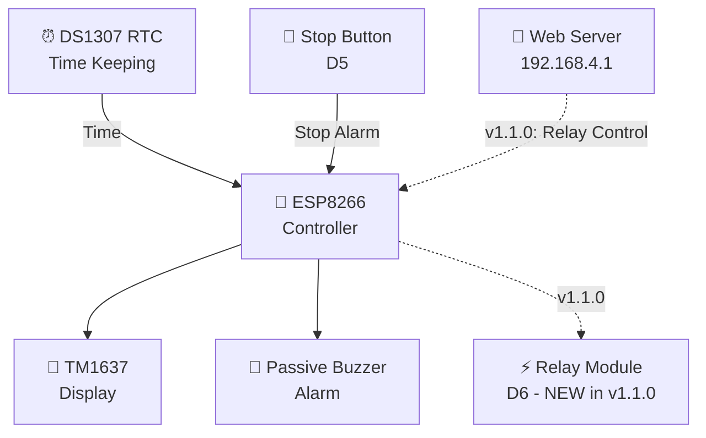
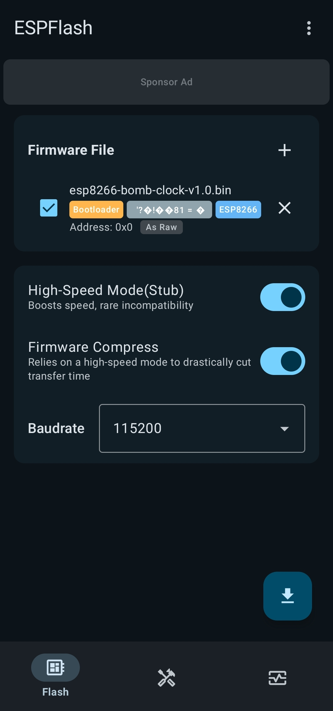
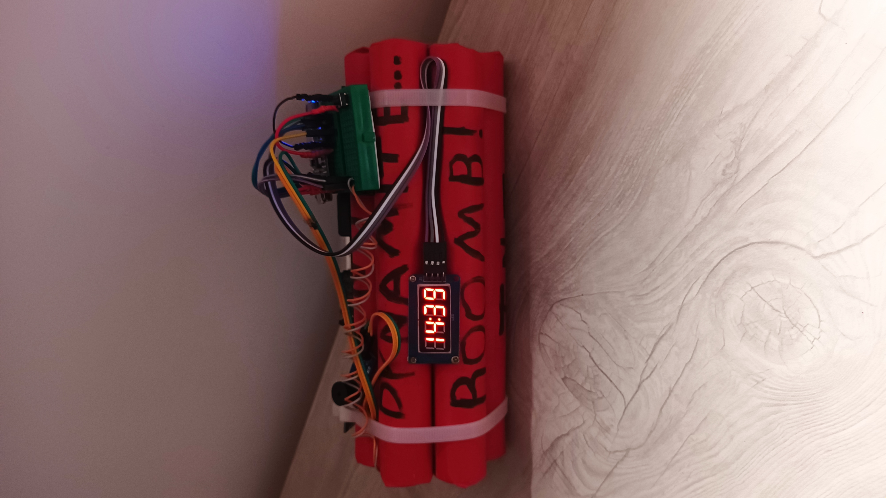
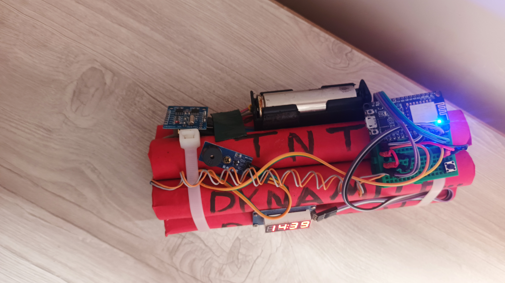
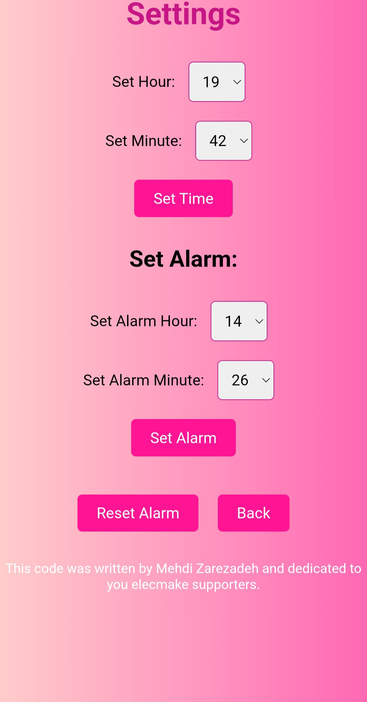

[


](https://github.com/husain6308/esp8266-bomb-clock/releases)
[


](LICENSE)
[


](https://github.com/husain6308/esp8266-bomb-clock)

# ESP8266 Bomb Clock

## 📚 Documentation

- [Hardware Documentation](HARDWARE.md)
- [Firmware Documentation](FIRMWARE.md)
- [Changelog](CHANGELOG.md)
- [License](LICENSE)

---

<h2 dir="rtl">💣 معرفی پروژه</h2>

<p dir="rtl"><b>ESP8266 Bomb Clock</b> یک ساعت رومیزی دکوراتیو با طراحی الهام‌گرفته از بمب ساعتی است که با استفاده از برد <b>NodeMCU Amica ESP8266</b> ساخته شده است.</p>

<p dir="rtl">هدف این پروژه، ایجاد یک وسیله الکترونیکی سرگرم‌کننده و دکوراتیو برای قرار دادن روی میز کار است.</p>

<p dir="rtl">زمان توسط ماژول <b>DS1307 RTC</b> نگهداری می‌شود و ساعت روی نمایشگر <b>TM1637</b> چهاررقمی نمایش داده می‌شود.</p>

<p dir="rtl">برای ایجاد افکت صوتی آلارم نیز از یک <b>Passive Buzzer</b> استفاده شده است. صدای آلارم به‌صورت یک افکت هشدار و شمارش معکوس طراحی شده تا ظاهر و فضای بمب ساعتی پروژه را کامل کند.</p>

<p dir="rtl">این پروژه صرفاً یک پروژه DIY، سرگرمی و دکوراتیو است.</p>

---

<h2 dir="rtl">📦 فریمور</h2>

<p dir="rtl">نسخه‌های موجود پروژه:</p>

<p dir="rtl">⬇️ <a href="https://github.com/husain6308/esp8266-bomb-clock/releases/download/V1.0.0/esp8266-bomb-clock-v1.0.bin">Download ESP8266 Bomb Clock v1.0.0</a></p>

<ul dir="rtl">
<li>نسخه: <code>v1.0.0</code></li>
<li>برد هدف: <b>NodeMCU Amica ESP8266</b></li>
<li>فایل: <code>esp8266-bomb-clock-v1.0.bin</code> (فریمور کامپایل‌شده)</li>
</ul>

<p dir="rtl">⬇️ <a href="https://github.com/husain6308/esp8266-bomb-clock/releases/download/V1.0.0/esp8266-bomb-clock-v1.1.ino">Download ESP8266 Bomb Clock v1.1.0</a></p>

<ul dir="rtl">
<li>نسخه: <code>v1.1.0</code></li>
<li>برد هدف: <b>NodeMCU Amica ESP8266</b></li>
<li>فایل: <code>esp8266-bomb-clock-v1.1.ino</code> (سورس کد Arduino)</li>
</ul>

---

<h2 dir="rtl">✨ امکانات</h2>

<ul dir="rtl">
<li><b>NodeMCU Amica ESP8266</b></li>
<li><b>DS1307 RTC</b> برای نگهداری زمان</li>
<li>نمایش ساعت با <b>TM1637</b> چهاررقمی</li>
<li><b>Passive Buzzer</b> برای آلارم</li>
<li>کلید فیزیکی برای قطع آلارم</li>
<li><b>Web Server</b> داخلی</li>
<li>ایجاد شبکه <b>Wi-Fi</b> توسط خود ESP8266</li>
<li>تنظیم ساعت از طریق مرورگر</li>
<li>تنظیم آلارم از طریق مرورگر</li>
<li>ذخیره تنظیمات در حافظه ESP8266 (EEPROM)</li>
<li>طراحی دکوراتیو با ظاهر بمب ساعتی</li>
<li><b>Firmware</b> آماده برای ESP8266</li>
<li>امکان نصب <b>Firmware</b> با گوشی <b>Android</b> بدون نیاز به کامپیوتر</li>
</ul>

<h2 dir="rtl">🆕 تغییرات v1.1.0</h2>

<ul dir="rtl">
<li>اضافه شدن <b>رله</b> روی پایه <code>D6 / GPIO12</code> با منطق کامل کنترل</li>
<li>روشن شدن خودکار رله هنگام آلارم و خاموش شدن خودکار آن</li>
<li>کنترل دستی رله از <b>Web Server</b></li>
<li>قطع رله، بازر و حالت دستی با دکمه‌ی <b>D5</b></li>
<li>تغییر سیستم بازر: فاصله‌ی بیپ‌ها هرچه به پایان نزدیک‌تر شود کمتر می‌شود</li>
<li>چشمک زدن نمایشگر هنگام آلارم و هماهنگی با الگوی بازر</li>
<li>تغییر نام <b>Wi-Fi Access Point</b> و <b>Password</b></li>
<li>آدرس <b>Web Server</b> همچنان <code>http://192.168.4.1</code></li>
<li>گسترده‌تر شدن صفحه‌ی <b>Settings</b> (تنظیم ثانیه‌ی ساعت و کنترل رله)</li>
<li>اضافه شدن سورس کامل <code>.ino</code> به Repository</li>
</ul>

---

<h2 dir="rtl">🧩 قطعات استفاده‌شده</h2>

<table dir="rtl">
<tr><th>قطعه</th><th>توضیح</th></tr>
<tr><td>NodeMCU Amica ESP8266</td><td>کنترلر اصلی</td></tr>
<tr><td>DS1307 RTC</td><td>نگهداری زمان</td></tr>
<tr><td>TM1637 4-Digit Display</td><td>نمایش ساعت</td></tr>
<tr><td>Passive Buzzer</td><td>تولید صدای آلارم</td></tr>
<tr><td>Push Button</td><td>قطع آلارم</td></tr>
</table>

<h3 dir="rtl">🧩 قطعات اضافه‌شده در نسخه v1.1.0</h3>

<table dir="rtl">
<tr><th>قطعه</th><th>توضیح</th></tr>
<tr><td>Relay Module</td><td>روشن شدن هنگام آلارم و کنترل از طریق وب‌سرور</td></tr>
</table>

---

<h2 dir="rtl">🔌 شماتیک اتصالات (Wiring Diagram)</h2>

<table dir="rtl">
<tr><th>قطعه</th><th>پایه قطعه</th><th>پایه ESP8266</th></tr>
<tr><td>TM1637</td><td>CLK</td><td>D2</td></tr>
<tr><td>TM1637</td><td>DIO</td><td>D1</td></tr>
<tr><td>TM1637</td><td>VCC</td><td>3.3V</td></tr>
<tr><td>TM1637</td><td>GND</td><td>GND</td></tr>
<tr><td>DS1307</td><td>SCL</td><td>D1</td></tr>
<tr><td>DS1307</td><td>SDA</td><td>D2</td></tr>
<tr><td>DS1307</td><td>VCC</td><td>3.3V</td></tr>
<tr><td>DS1307</td><td>GND</td><td>GND</td></tr>
<tr><td>Passive Buzzer</td><td>I/O</td><td>D4</td></tr>
<tr><td>Passive Buzzer</td><td>VCC</td><td>3.3V</td></tr>
<tr><td>Passive Buzzer</td><td>GND</td><td>GND</td></tr>
<tr><td>Push Button (Stop)</td><td>پایه ۱</td><td>D5</td></tr>
<tr><td>Push Button (Stop)</td><td>پایه ۲</td><td>GND</td></tr>
</table>

<h3 dir="rtl">🔌 اتصالات اضافه‌شده در نسخه v1.1.0</h3>

<table dir="rtl">
<tr><th>قطعه</th><th>پایه قطعه</th><th>پایه ESP8266</th></tr>
<tr><td>Relay Module</td><td>IN</td><td>D6</td></tr>
<tr><td>Relay Module</td><td>VCC</td><td>3.3V</td></tr>
<tr><td>Relay Module</td><td>GND</td><td>GND</td></tr>
</table>

<h3 dir="rtl">⚠️ نکته درباره اتصالات</h3>

<p dir="rtl">در پروژه از این GPIOها استفاده شده است:</p>

<table dir="rtl">
<tr><th>قطعه</th><th>پایه قطعه</th><th>پایه ESP8266</th></tr>
<tr><td>TM1637 و DS1307</td><td>DIO و SCL</td><td>D1 / GPIO5</td></tr>
<tr><td>TM1637 و DS1307</td><td>CLK و SDA</td><td>D2 / GPIO4</td></tr>
<tr><td>Passive Buzzer</td><td>I/O</td><td>D4 / GPIO2</td></tr>
<tr><td>Alarm Stop Button</td><td>پایه ۱</td><td>D5</td></tr>
<tr><td>Alarm Stop Button</td><td>پایه ۲</td><td>GND</td></tr>
<tr><td>Relay Module (v1.1.0)</td><td>IN</td><td>D6 / GPIO12</td></tr>
</table>

---

<h2 dir="rtl">⏰ سیستم ساعت</h2>

<p dir="rtl">ماژول <b>DS1307 RTC</b> وظیفه نگهداری زمان را بر عهده دارد.</p>

<p dir="rtl"><b>ESP8266</b> زمان را از DS1307 دریافت کرده و آن را روی نمایشگر <b>TM1637</b> نمایش می‌دهد.</p>

<h3 dir="rtl">ساختار کلی سیستم:</h3>



<p dir="rtl">خط‌چین‌ها در نمودار یعنی آن بخش فقط در نسخه <b>v1.1.0</b> وجود دارد.</p>

<h3 dir="rtl">📌 تفاوت نسخه‌ها</h3>

<table dir="rtl">
<tr><th>ویژگی</th><th>v1.0.0</th><th>v1.1.0</th></tr>
<tr><td>نمایش ساعت با TM1637</td><td>دارد</td><td>دارد</td></tr>
<tr><td>آلارم با Passive Buzzer</td><td>دارد</td><td>دارد</td></tr>
<tr><td>دکمه‌ی Stop (D5)</td><td>قطع آلارم</td><td>قطع آلارم، بازر و رله</td></tr>
<tr><td>ماژول رله (D6)</td><td>ندارد</td><td>دارد</td></tr>
<tr><td>کنترل دستی رله از Web Server</td><td>ندارد</td><td>دارد</td></tr>
<tr><td>فاصله‌ی بیپ‌ها</td><td>ثابت</td><td>هرچه به پایان نزدیک‌تر، کمتر</td></tr>
<tr><td>چشمک زدن نمایشگر هنگام آلارم</td><td>ندارد</td><td>دارد</td></tr>
<tr><td>نام Wi-Fi</td><td>ESP8266-Clock</td><td>ESP8266-Clock-v1.1</td></tr>
<tr><td>تنظیم ثانیه‌ی ساعت از وب</td><td>ندارد</td><td>دارد</td></tr>
<tr><td>سورس کد (.ino)</td><td>در دسترس نیست</td><td>در دسترس است</td></tr>
</table>

---

<h2 dir="rtl">🌐 Web Server</h2>

<p dir="rtl">ESP8266 پس از راه‌اندازی، یک شبکه Wi-Fi ایجاد می‌کند و برای دسترسی به پنل تنظیمات نیازی به مودم یا اینترنت ندارد.</p>

<h3 dir="rtl">Wi-Fi Access Point</h3>

<table dir="rtl">
<tr><th>نسخه</th><th>SSID</th><th>Password</th></tr>
<tr><td>v1.0.0</td><td>ESP8266-Clock</td><td>12345678</td></tr>
<tr><td>v1.1.0</td><td>ESP8266-Clock-v1.1</td><td>sain6308</td></tr>
</table>

<h3 dir="rtl">ورود به Web Server</h3>

<ol dir="rtl">
<li>با گوشی یا دستگاه دیگر به شبکه Wi-Fi ساعت متصل شوید.</li>
<li>مرورگر را باز کنید و آدرس <code>http://192.168.4.1</code> را وارد کنید.</li>
<li>پنل وب ساعت نمایش داده می‌شود.</li>
</ol>

<p dir="rtl">آدرس Web Server در هر دو نسخه یکسان است.</p>

---

<h2 dir="rtl">⚙️ تنظیم ساعت و آلارم</h2>

<p dir="rtl">از طریق Web Server می‌توان تنظیمات مربوط به ساعت و آلارم را انجام داد.</p>

<h3 dir="rtl">امکانات نسخه v1.0.0</h3>

<ul dir="rtl">
<li>تنظیم ساعت</li>
<li>تنظیم زمان آلارم</li>
<li>مدیریت تنظیمات آلارم</li>
<li>ذخیره تنظیمات</li>
<li>مشاهده اطلاعات مربوط به ساعت و آلارم</li>
</ul>

<h3 dir="rtl">صفحه‌ی Settings در نسخه v1.1.0</h3>

<table dir="rtl">
<tr><th>بخش</th><th>امکانات</th></tr>
<tr><td>Clock</td><td>Hour، Minute، Second</td></tr>
<tr><td>Alarm</td><td>Hour، Minute، Reset Alarm</td></tr>
<tr><td>Relay</td><td>کلید ON/OFF</td></tr>
</table>

<p dir="rtl">ساعت آلارم، دقیقه‌ی آلارم و فعال یا غیرفعال بودن آن در حافظه‌ی <b>EEPROM</b> ذخیره می‌شود تا پس از خاموش و روشن شدن دستگاه هم حفظ شود. این ویژگی از نسخه‌ی قبل بدون تغییر باقی مانده است.</p>

---

<h2 dir="rtl">🚨 سیستم آلارم</h2>

<p dir="rtl">برای آلارم از یک <b>Passive Buzzer</b> استفاده شده است. صدای آلارم به‌صورت یک افکت هشدار و شمارش معکوس طراحی شده که با ظاهر بمب ساعتی پروژه هماهنگ است.</p>

<p dir="rtl">آلارم را می‌توان با کلید فیزیکی متصل به <b>D5</b> متوقف کرد:</p>

```
D5 ───── Push Button ───── GND
```

<h3 dir="rtl">🔔 تغییرات سیستم بازر (v1.1.0)</h3>

<table dir="rtl">
<tr><th>مورد</th><th>مقدار</th></tr>
<tr><td>مدت کل آلارم</td><td>۴۰ ثانیه</td></tr>
<tr><td>مدت هر بیپ</td><td>۱۶۰ میلی‌ثانیه</td></tr>
<tr><td>فرکانس</td><td>1000Hz</td></tr>
<tr><td>ثانیه ۳۵ تا ۴۰</td><td>بازر پیوسته</td></tr>
</table>

<p dir="rtl">فاصله‌ی بین بیپ‌ها ثابت نیست و هرچه به پایان شمارش نزدیک‌تر شویم کمتر می‌شود.</p>

<p dir="rtl">در v1.1.0 نمایشگر هم در طول شمارش معکوس با الگوی بازر بین روشن و خاموش تغییر می‌کند و در ۵ ثانیه‌ی آخر روشن می‌ماند.</p>

<h3 dir="rtl">🔘 دکمه‌ی D5</h3>

<p dir="rtl">در v1.0.0 دکمه فقط آلارم را قطع می‌کرد. در v1.1.0 با فشردن آن:</p>

<ul dir="rtl">
<li>بازر خاموش می‌شود.</li>
<li>آلارم متوقف می‌شود.</li>
<li>رله خاموش می‌شود.</li>
<li>حالت دستی رله لغو می‌شود.</li>
</ul>

---

<h2 dir="rtl">⚡ سیستم رله (v1.1.0)</h2>

<p dir="rtl">در نسخه‌ی v1.1.0 یک ماژول رله روی پایه <b>D6 / GPIO12</b> اضافه شده است. رله به‌صورت خودکار هنگام آلارم روشن می‌شود و از طریق <b>Web Server</b> هم می‌توان آن را دستی روشن و خاموش کرد.</p>

<h3 dir="rtl">زمان‌بندی آلارم و رله</h3>

<p dir="rtl">آلارم <b>۴۰ ثانیه</b> قبل از زمان تعیین‌شده شروع می‌شود:</p>

<table dir="rtl">
<tr><th>زمان از شروع آلارم</th><th>اتفاق</th></tr>
<tr><td>ثانیه ۰</td><td>شروع شمارش معکوس و بیپ‌ها</td></tr>
<tr><td>ثانیه ۳۵</td><td>بازر پیوسته می‌شود و رله روشن می‌شود</td></tr>
<tr><td>ثانیه ۴۰</td><td>پایان آلارم صوتی و رسیدن به زمان تعیین‌شده</td></tr>
<tr><td>ثانیه ۶۵</td><td>رله خودکار خاموش می‌شود</td></tr>
</table>

<p dir="rtl"><b>نکته:</b> رله ۳۰ ثانیه روشن می‌ماند و از ثانیه ۳۵ تا ثانیه ۶۵ نسبت به شروع آلارم فعال است. بنابراین رله می‌تواند <b>۲۵ ثانیه بعد از پایان آلارم صوتی</b> هم هنوز روشن باشد.</p>

<h3 dir="rtl">کنترل دستی رله</h3>

<ul dir="rtl">
<li>در صفحه‌ی <b>Settings</b> در Web Server یک کلید <b>ON/OFF</b> برای رله وجود دارد.</li>
<li>برای کنترل رله دو مسیر جدید به Web Server اضافه شده است.</li>
<li>با فشردن دکمه‌ی <b>D5</b>، رله خاموش و حالت دستی لغو می‌شود.</li>
</ul>

---

<h2 dir="rtl">📱 نصب Firmware با گوشی Android</h2>

<p dir="rtl"><b>توجه:</b> این آموزش مربوط به فایل کامپایل‌شده‌ی <code>.bin</code> نسخه‌ی <b>v1.0.0</b> است. برای نسخه‌ی v1.1.0 باید فایل <code>.ino</code> را با Arduino IDE یا ArduinoDroid کامپایل و آپلود کنید.</p>

<p dir="rtl">یکی از ویژگی‌های مهم این پروژه این است که Firmware آن را می‌توان بدون کامپیوتر و مستقیماً با گوشی Android روی ESP8266 نصب کرد.</p>

<p dir="rtl">برنامه‌ی مورد استفاده: <b>ESPFlash-ESP32/ESP8266Flasher</b> که از فلش کردن Firmware روی ESP8266 از طریق USB OTG پشتیبانی می‌کند.</p>

<p dir="rtl">Google Play: <a href="https://play.google.com/store/apps/details?id=io.serialflow.espflash">ESPFlash</a></p>

<h3 dir="rtl">۱. آماده‌سازی</h3>

<p dir="rtl">موارد مورد نیاز:</p>

<ul dir="rtl">
<li>گوشی Android</li>
<li>برد NodeMCU Amica ESP8266</li>
<li>کابل USB مناسب</li>
<li>در صورت نیاز، مبدل USB OTG</li>
<li>فایل Firmware: <code>esp8266-bomb-clock-v1.0.bin</code></li>
</ul>

<p dir="rtl">گوشی را از طریق USB به ESP8266 متصل کنید.</p>

<h3 dir="rtl">۲. اجرای برنامه</h3>

<p dir="rtl">برنامه‌ی ESPFlash را باز کنید و در قسمت <b>Firmware File</b> روی علامت <b>+</b> بزنید.</p>

<h3 dir="rtl">۳. اضافه کردن Firmware</h3>

<p dir="rtl">صفحه‌ای با عنوان <b>Add Firmware</b> باز می‌شود. فایل <code>esp8266-bomb-clock-v1.0.bin</code> را از حافظه‌ی گوشی انتخاب کنید.</p>

<h3 dir="rtl">۴. تنظیم Address</h3>

<p dir="rtl">مقدار Address را روی <code>0x0000</code> قرار دهید.</p>

<h3 dir="rtl">۵. High-Speed Mode</h3>

<p dir="rtl">گزینه‌ی <b>High-Speed Mode (Stub)</b> در این پروژه فعال بوده است. این گزینه سرعت انتقال Firmware را افزایش می‌دهد.</p>

<h3 dir="rtl">۶. Firmware Compress</h3>

<p dir="rtl">گزینه‌ی <b>Firmware Compress</b> نیز فعال بوده است. این گزینه به حالت High-Speed Mode وابسته است و زمان انتقال را کاهش می‌دهد.</p>

<h3 dir="rtl">۷. Baudrate</h3>

<p dir="rtl">مقدار Baudrate را روی <code>115200</code> قرار دهید.</p>

<h3 dir="rtl">۸. شروع Flash</h3>

<p dir="rtl">روی دکمه‌ی <b>Upload / Flash</b> که با علامت فلش رو به پایین نمایش داده می‌شود بزنید و منتظر بمانید تا عملیات کامل شود.</p>

<h3 dir="rtl">۹. پایان عملیات</h3>

<p dir="rtl">پس از پایان موفقیت‌آمیز عملیات، ESP8266 را راه‌اندازی مجدد کنید. در صورت اجرای صحیح Firmware، دستگاه باید به حالت ساعت و Web Server پروژه وارد شود.</p>

<h3 dir="rtl">📌 تنظیمات Flash استفاده‌شده در این پروژه</h3>

<table dir="rtl">
<tr><th>مورد</th><th>مقدار</th></tr>
<tr><td>Firmware</td><td>esp8266-bomb-clock-v1.0.bin</td></tr>
<tr><td>Address</td><td>0x0000</td></tr>
<tr><td>High-Speed Mode (Stub)</td><td>ON</td></tr>
<tr><td>Firmware Compress</td><td>ON</td></tr>
<tr><td>Baudrate</td><td>115200</td></tr>
</table>

<p dir="rtl"><i>این تنظیمات بر اساس روش واقعی استفاده‌شده برای نصب Firmware این پروژه ثبت شده‌اند. در صورت استفاده از Firmware یا برد متفاوت، ممکن است تنظیمات Flash متفاوت باشند.</i></p>

<h3 dir="rtl">📷 تصویر برنامه Android</h3>

<p dir="rtl">تصاویر زیر محیط برنامه‌ی ESPFlash-ESP32/ESP8266Flasher را برای نصب Firmware پروژه نشان می‌دهند.</p>





---

<h2 dir="rtl">📷 تصاویر پروژه</h2>

<h3 dir="rtl">نمای ظاهری</h3>








<h3 dir="rtl">تصاویر وب سرور</h3>





---

<h2 dir="rtl">💻 Source Code</h2>

<ul dir="rtl">
<li><b>v1.0.0:</b> فقط فایل کامپایل‌شده‌ی <code>.bin</code> موجود است و سورس اصلی Arduino در دسترس نیست. فایل <code>.bin</code> مانند <code>.ino</code> قابل ویرایش مستقیم نیست.</li>
<li><b>v1.1.0:</b> سورس کامل در مسیر <code>firmware/esp8266-bomb-clock-v1.1.ino</code> موجود است.</li>
</ul>

---

<h2 dir="rtl">🛠️ وضعیت پروژه</h2>

<p dir="rtl"><b>Project Status:</b> Completed / Archived Firmware</p>

<p dir="rtl">این Repository برای نگهداری، پشتیبان‌گیری و مستندسازی پروژه ایجاد شده است.</p>

<p dir="rtl">موارد موجود:</p>

<ul dir="rtl">
<li>Firmware کامپایل‌شده‌ی ESP8266 (v1.0.0)</li>
<li>سورس کد کامل (v1.1.0)</li>
<li>اطلاعات سخت‌افزار</li>
<li>شماتیک اتصالات</li>
<li>تصاویر پروژه</li>
<li>تصاویر Web Server</li>
<li>آموزش نصب Firmware با Android</li>
<li>اطلاعات Web Server</li>
</ul>

---

<h2 dir="rtl">👤 سازنده</h2>

<p dir="rtl"><b>HUSAIN</b></p>

Designed, assembled and developed as a personal DIY electronics project.
